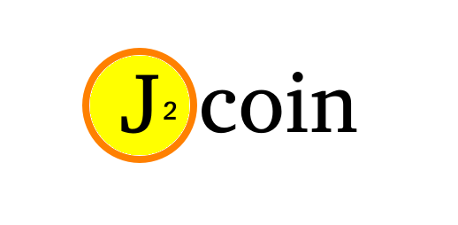

  

*turns out there already was a 'jcoin' out there, hence the 2

# cryptocoinage of the present, available in the future! (WIP)

- [x] something something blockchain!
  - [ ] create public ledger with digital signatures for transaction details
  - [ ] dynamic difficulity (scaling with network hashrate)
- [ ] web js reference miner
- [ ] web faucet! (place to just spew out jcoins to all that want some!)
  - [ ] early miners I make & run can put their coins into a public faucet & development bounty pool
- [ ] web wallet!
  - [ ] wallet generation of private/public key pairs (RSA maybe?) used for transaction
- [ ] plan to switch over to Proof of Stake system from the get-go! (a greener coin alternative!)
  - [ ] after the Nth block has been mined, the block mining reward is set to 0, and the coin should automatically switch miners / nodes over to Proof of Stake?
  - [ ] nodes have to choose how much they want to stake
- [ ] web status page (coin info roadmap, progress towards PoS switchover, network hashrate, block info, transaction info... etc)
- [ ] nodes! (blockchain host & share!)

## screenshot of WIP! 

  

here you can see that there's a _blockchain_!
